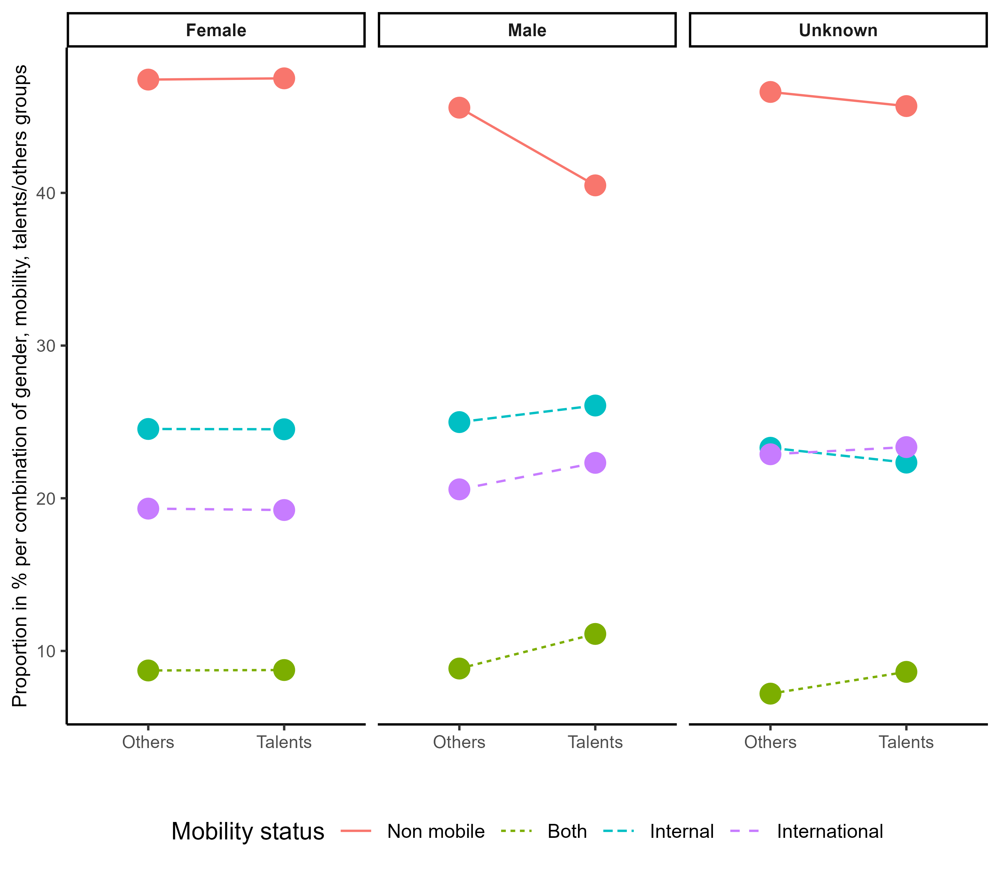
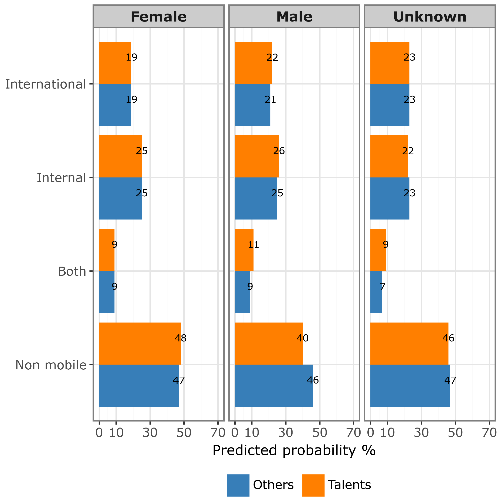
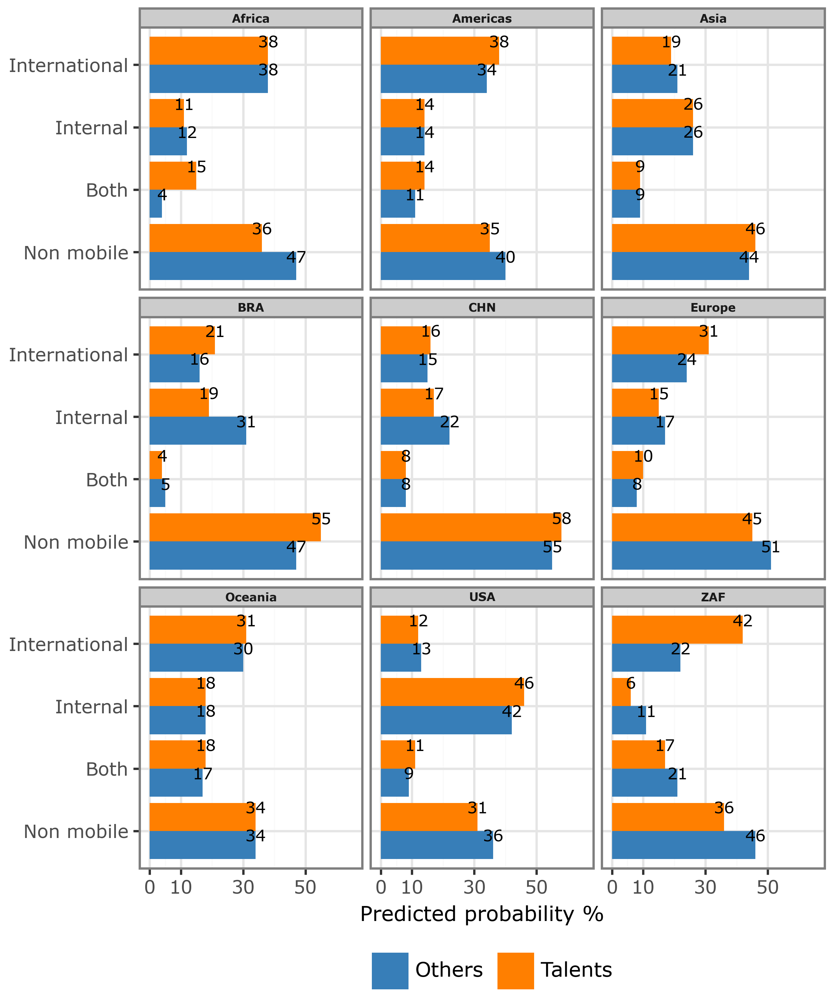
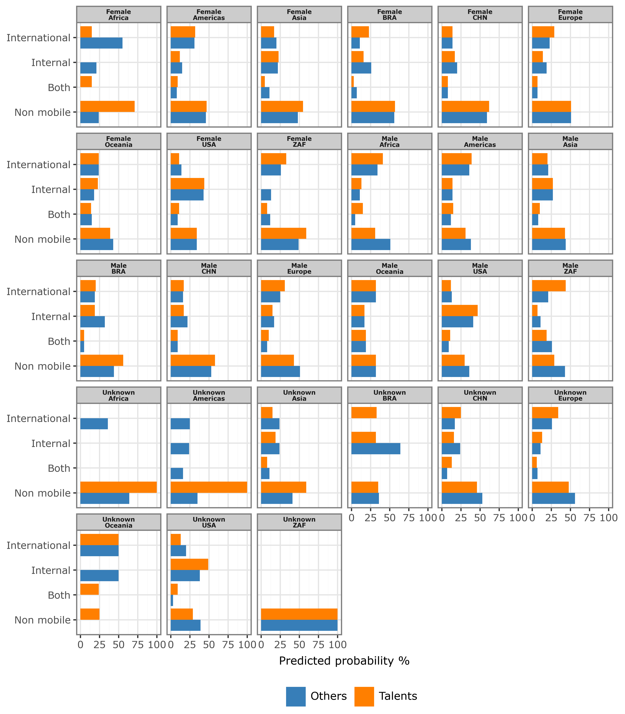
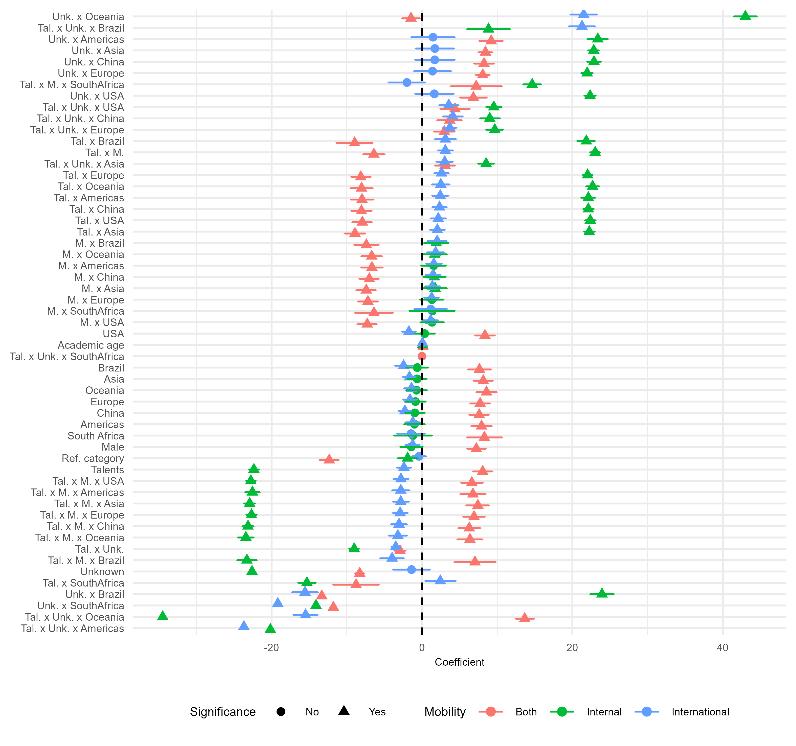

# Scripts, data, and replication materials for "A study of gender and regional differences in scientific mobility and immobility among researchers identified as potentially talented"

This repository includes replication materials including data, Python and R scripts to replicate the analysis and figures of the article with following metadata. They also include additional results that were not included in the manuscript and supplementary information due to space limitations but are provided here, e.g., using alternative gender assignments, or more granular classification for geographical regions.

**Script authors/maintainers**: [Aliakbar Akbaritabar](https://github.com/akbaritabar)

**Contact**: [akbaritabar@demogr.mpg.de](akbaritabar@demogr.mpg.de)

**Article title**: A study of gender and regional differences in scientific mobility and immobility among researchers identified as potentially talented

**Manuscript authors**: Aliakbar Akbaritabar, Robin Haunschild and Lutz Bornmann

**Journal**: Journal of Informetrics

**Article DOI**: [https://doi.org/10.1016/j.joi.2025.101744](https://doi.org/10.1016/j.joi.2025.101744)

**Abstract**:
Identifying talented academics worldwide using publication data has been proven to be successful with other performance measures based on citations and funding data in previous studies. In this study, we investigate the scientific mobility and immobility among academics as an additional performance measure. We reconstruct the mobility trajectory of potentially talented researchers throughout their scientific careers to study whether they have a different propensity to be mobile or non-mobile than other researchers in the group for comparison. Since the researchers’ gender may play an important role in scientific careers, we delve into gender differences. Our results indicate that potentially talented researchers have a higher propensity to be mobile than other researchers in the group for comparison – more so among male than female talented researchers. Women are overrepresented among non-mobile researchers in the other researchers group. We conclude – based on our findings – that the proposed method for identifying potentially talented individuals seems to select researchers who are more successful in their academic careers than the researchers in the group for comparison. The results agree with the findings of the previous studies based on citation and funding data. In the interpretation of our study results, one should consider yet that higher mobility is a privilege (that may be independent of talent). Specific groups, such as those with fewer caring responsibilities and visa restrictions, could have better access to this privilege. Further research is necessary thus on the trade-off between higher mobility's potential advantages and disadvantages as a strategy to build a successful academic career and unequal access to mobility.

**Keywords**: talented academics, bibliometric indicators, scientific mobility and immobility, gendered mobility

## How to replicate the analysis

I have provided the scripts, data, and the reproducible pipeline that creates final data for our manuscript, and runs the analysis and visualizations using R and Python. This includes the preparation of data, statistical analysis, visualizations (see figures under `results` folder). These reproducible pipeline uses scripts that are developed in Python and the reproducible workflow (described below) uses SnakeMake workflow management to ensure full replicability. 

There are also R scripts for statistical analysis of the manuscript (see them in `workflow\scripts` folder) and figures in the manuscript and SI (see them under `results` folder).

Below, we describe the requirements to install before you can replicate the analysis.

## Python requirements

For the reproducible pipeline to recreate the paper's replication data and analysis, you need to have [SnakeMake](https://snakemake.readthedocs.io/en/stable/index.html) version 8 or above installed. Creating a conda environment with Python 3 (3.11.9 was used here) and the following libraries (for instance by running `conda env create -f requirements.yml` and after copying the following yml code into a file: "requirements.yml") enables reproducing the pipeline by opening CLI, activating the conda environment i.e., `conda activate talents`, and running a dry-run with `snakemake -np all` or a full reproduction with `snakemake --cores 4 all`.

**An HTML report shows the a directed acyclic graph (DAG)** of the dependency of the steps in the pipeline (rules in SnakeMake lingua) which is accessible in [https://akbaritabar.github.io/Replication-package-for-gender-and-regional-differences-in-scientific-mobility-and-immobility](https://akbaritabar.github.io/Replication-package-for-gender-and-regional-differences-in-scientific-mobility-and-immobility) which looks like the photo below. 


Please note that some of these rules require Scopus data at the individual level which is licensed and we cannot share them publicly. Hence, these output files are commented out from the main Snakefile and rule all. However, the aggregated data to prepare the analysis presented in teh manuscript and statistical models to recreate all our figures are included in this repository which completely complies with the license terms of the data provider. 

```yml
name: talents
channels:
  - conda-forge
  - bioconda
  # to prevent using default anaconda channels
  - nodefaults
dependencies:
- python 3.*
- pandas
- pyarrow
- plotnine
- argparse
- numpy
- mizani # (is installed with plotnine)
- duckdb
- tabulate


```


## R packages

To replicate the statistical analysis, following packages should be installed. The scripts and the data used in them are in the folder `workflow\scripts`.

```R

install.packages(c("tidyverse", "RColorBrewer", "argparser", "nnet", "broom", "countrycode", "nanoparquet", "stargazer", "texreg", "GGally", "ggeffects", "lmtest", "DescTools"))

```


# Publication figures

Here are figures 1-5 in the main manuscript. All figures, including these and the Supplementary Information (SI) figures, are available in the `results` folder.

## Figure 1: Percentage of unique authors (y axis) in talents and others group (x axis) divided by mobility status (line color/type) and authors’ gender (three facets). A line is drawn between the circles for talents/others group to facilitate a comparison. Two alternative versions of this figure using other gender assignment methods can be found in the appendix.




## Figure 2: Predicted probability of mobility and being non-mobile between talents and others group by authors’ gender (see the models’ coefficients in Table A2 in the Appendix). The reference group in this model was female scholars in the others group.




## Figure 3: Predicted probability of mobility and being non-mobile between talents and others group in addition to the authors’ continent of affiliation. An interaction term is included between membership in talents/others group and authors’ continent (see the models’ coefficients in Table A2 in the Appendix). The reference group in this model was researchers in others group affiliated with institutions in Africa. The largest science systems in each continent (except for Europe and Oceania) are assigned to separate categories, e.g., USA, CHN, BRA, and ZAF, to highlight their results.




## Figure 4: Predicted probabilities of talents and others group in interaction with both gender and region based on the full model with control variables (see Table A2 in the Appendix for coefficients). The reference group in this model was female scholars in others group who were affiliated with institutions in Africa. The largest science systems in each continent (except for Europe and Oceania) are assigned to separate categories, e.g., USA, CHN, BRA, and ZAF, to highlight their results.




## Figure 5: Coefficients (x axis), confidence intervals, and significance level of terms (on the y axis) for different independent variable categories and interactions among them (see y axis labels where “x” indicates and interaction). The results are shown across the three types of mobility, i.e., internal (green), international (blue), and both (red). Unk. = Unknown gender. Tal. = identified talents. M. = Male scholars. A circle indicates that a coefficient is not statistically significant, and a triangle indicates the opposite. 



